<div align="center">

# PrepareYourself

**Bangladesh's smart exam preparation platform for SSC & HSC students**

[](https://github.com/turtle-xo7/PrepareYourself/actions/workflows/ci.yml)
[](https://python.org)
[](https://djangoproject.com)
[](LICENSE)
[](core/test_selenium/)
[]()

[Screenshots](#-screenshots) • [Features](#-features) • [Architecture](#-architecture) • [Tech Stack](#-tech-stack) • [Setup](#-getting-started) • [Tests](#-running-tests) • [Team](#-team)

</div>

---

## What is PrepareYourself?

PrepareYourself is a full-stack web platform that helps Bangladeshi SSC & HSC students prepare for board exams through:

- **Adaptive practice** — board-specific MCQ and Creative Question (CQ) banks organized by subject, class, chapter, and year
- **Teacher grading** — verified teachers provide per-part CQ feedback directly on the platform
- **Competitive contests** — rated timed exams with live leaderboards, Elo-style ratings, PrepCoins, badges, and virtual replays
- **Study resources** — curated notes (PDF/text), interactive science labs, and practical video lessons

Built by a 4-person agile team over one semester using Scrum methodology.

---

## 📸 Screenshots

> The full UI is bilingual (বাংলা / English) and ships with complete light & dark themes.

| Home | Student Dashboard |
|:---:|:---:|
| 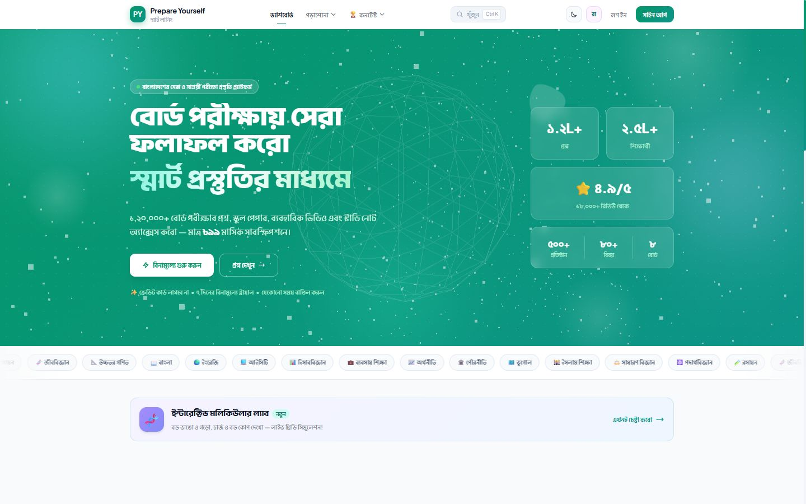 | 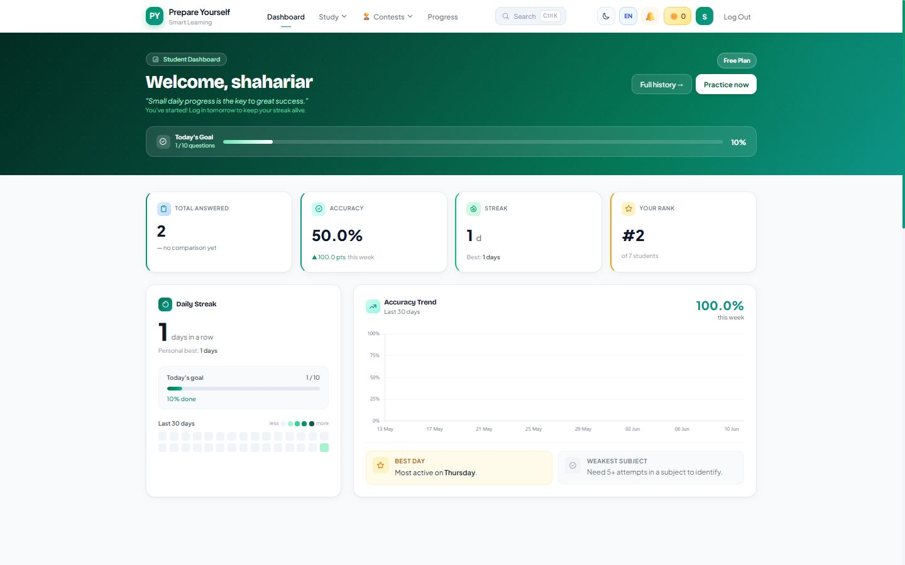 |

| Question Bank (dark) | Contests |
|:---:|:---:|
| 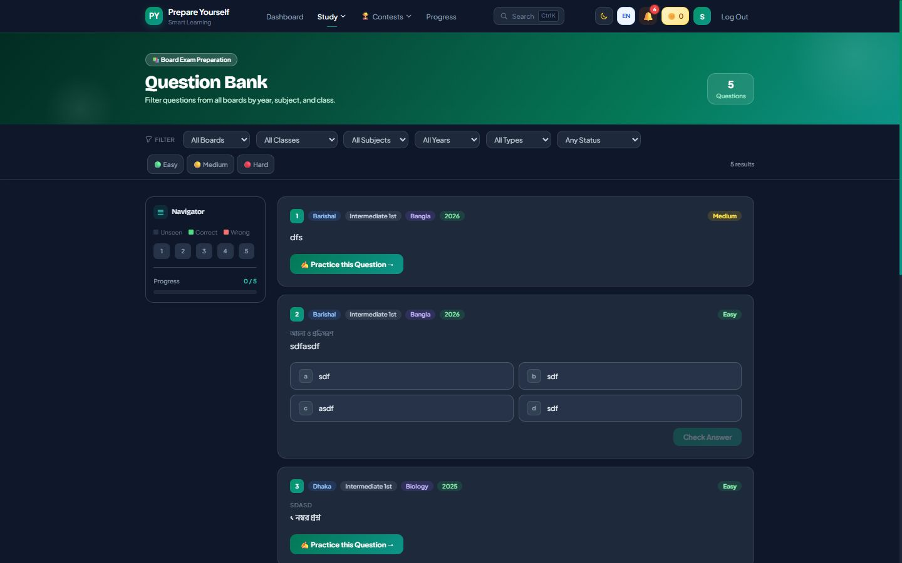 | 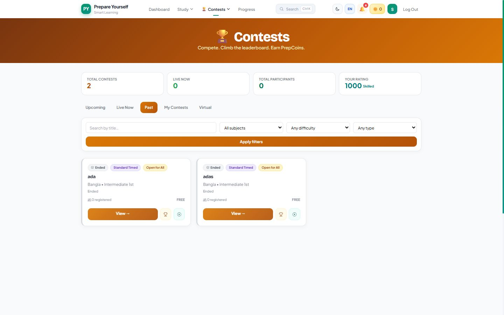 |

| Interactive Practical Lab | Contest Profile |
|:---:|:---:|
| 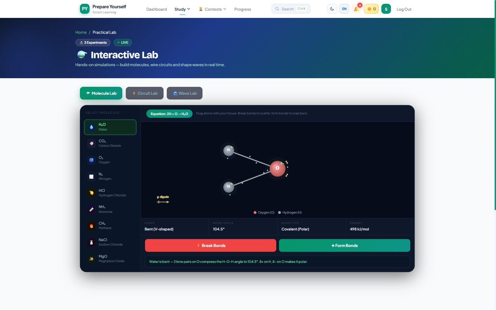 | 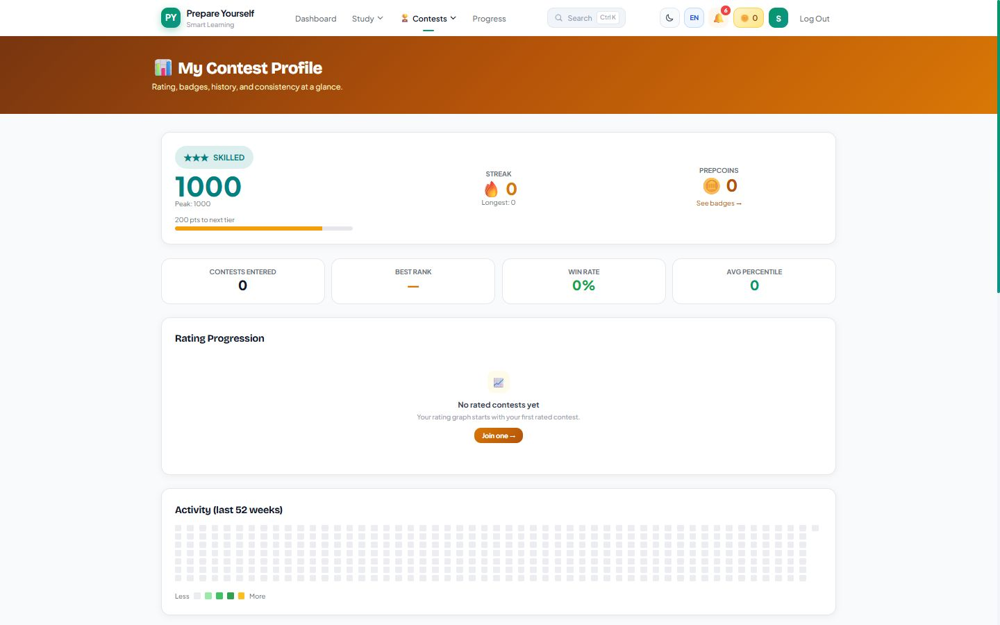 |

| Teacher Dashboard (dark) | Super Admin Control Centre |
|:---:|:---:|
| 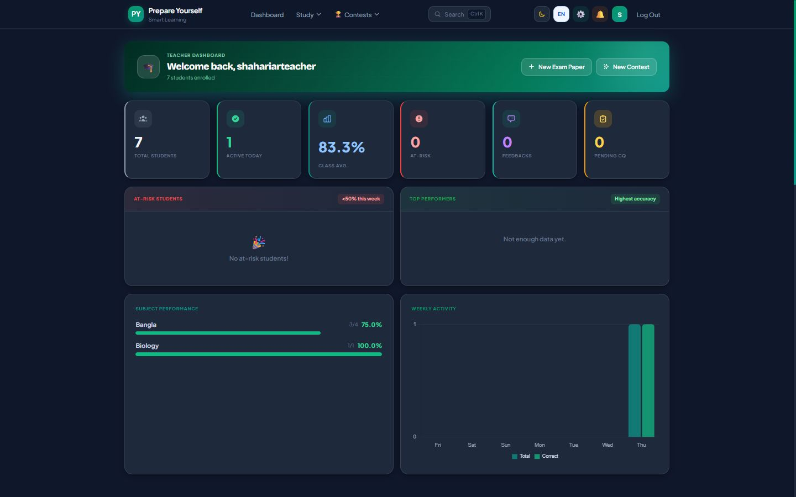 | 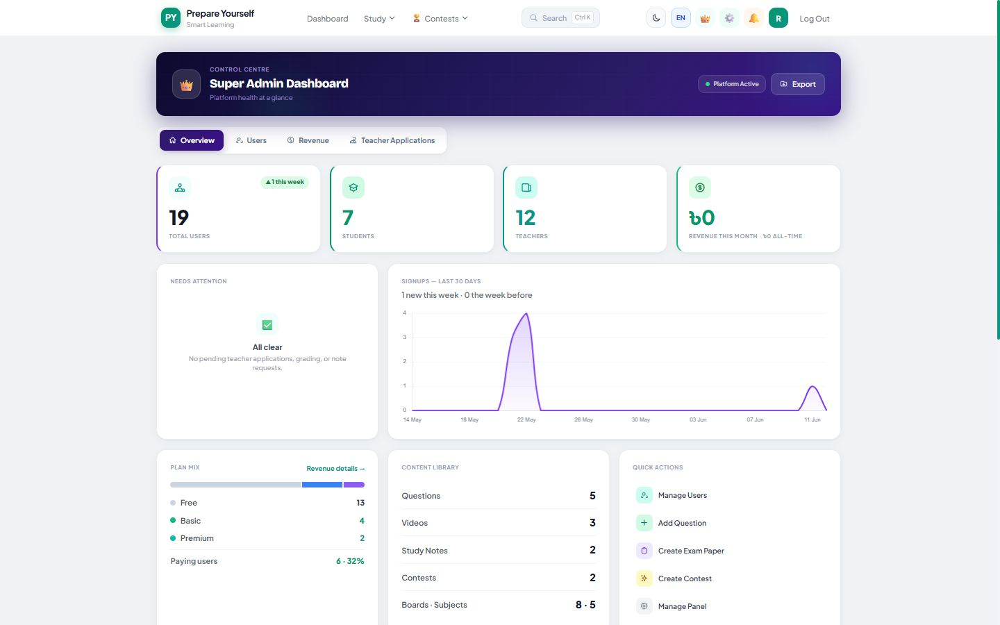 |

| Manage Panel (dark) | Login |
|:---:|:---:|
| 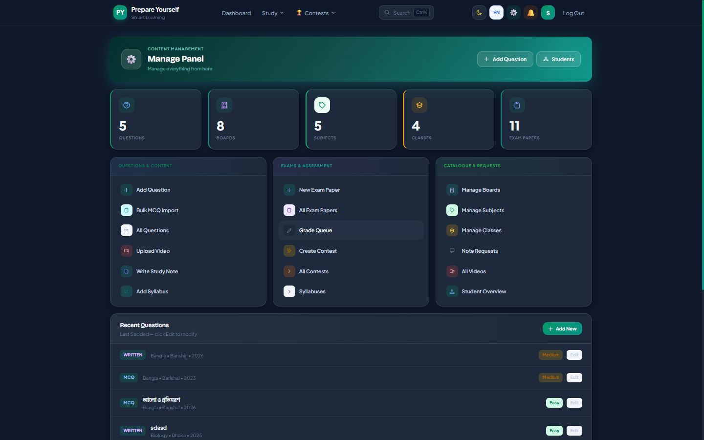 | 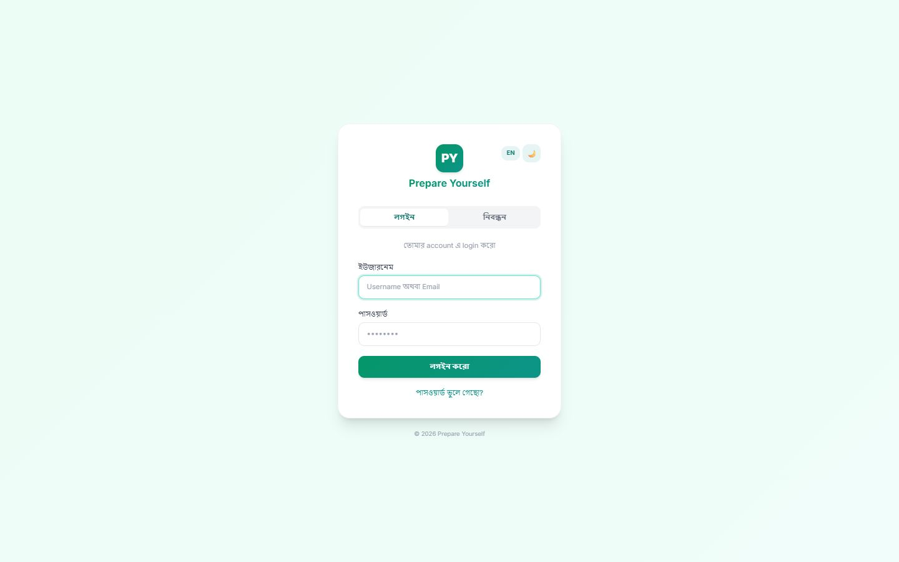 |

---

## ✨ Features

| Category | Feature |
|----------|---------|
| **Question Bank** | MCQ & CQ (Creative) questions filtered by board, class, subject, year, chapter, difficulty, and solve status — with instant answer checking and progress tracking |
| **Exam Engine** | Timed MCQ phase + CQ written submission with photo upload per part (ক/খ/গ/ঘ) |
| **Teacher System** | Verified teacher accounts (NID + qualification review), subject claiming, per-part CQ grading with comments |
| **Contests** | Scheduled rated/unrated contests, live leaderboards, Elo-style rating tiers, podium results & per-question stats |
| **Gamification** | PrepCoins ledger, earnable badge gallery, daily streaks, rank titles, virtual contest replays of past contests |
| **Study Notes** | Rich text + PDF notes, bookmarks, scroll-based read-progress tracking, moderated comment threads |
| **Practical Lab** | Interactive simulations (molecule builder, circuit lab, wave lab) + YouTube video lessons by subject and class |
| **Syllabus** | Board-wise structured syllabus viewer |
| **Subscriptions** | Free / Basic / Premium tiers with payment simulation and plan expiry |
| **Global Search** | `Ctrl K` command-palette search across questions, notes, and exam papers with skeleton loading states |
| **Notifications** | Real-time bilingual notification system + toast notifications on every page |
| **Bilingual UI** | Full interface in Bangla and English; user-selectable, including Bengali numerals in charts |
| **Dark Mode** | Complete dark theme across every page, persisted per user, with live re-skinning of charts |
| **Admin Panel** | Custom Manage Panel + Super Admin control centre (user/role/plan management, revenue stats, Excel export) and Jazzmin-powered Django admin |
| **Testing** | 190+ Selenium E2E tests + Django unit suite, run in CI on every push |

---

## 🔬 Spotlight — Interactive Practical Lab

Science practicals are hard to access for many students — so the platform ships a fully
client-side, bilingual lab where they can run the experiments themselves. No plugins,
no downloads: three canvas-based simulations rendered in real time.


| Lab | What students can do |
|-----|----------------------|
| ⚗️ **Molecule Lab** | Build and break 9 molecules (H₂O, CO₂, NH₃, CH₄, NaCl…) by dragging atoms — live bond angles, molecular shape, bond type, polarity dipole, and bond energy update as the structure changes |
| ⚡ **Circuit Lab** | A live DC circuit with battery-voltage and resistance sliders, an on/off switch, animated electron flow with conventional-current arrows, and a resistor that visibly heats (with shimmer) following *P = I²R* |
| 🌊 **Wave Lab** | Frequency, amplitude and speed controls on a travelling wave — add the reflected wave to superpose into a standing wave with labelled nodes and antinodes, plus plain-language physics explanations in both Bangla and English |

Every simulation pairs the visuals with a fact box that explains *why* — turning each
experiment into a mini-lesson.

---

## 🏗 Architecture

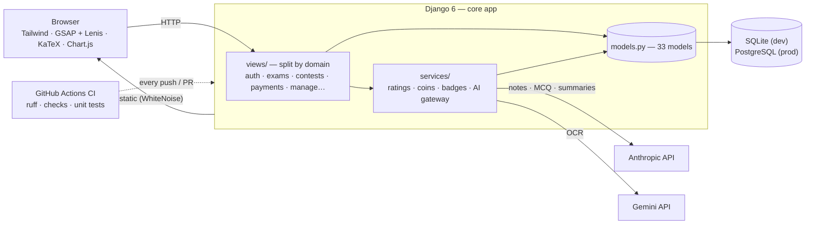

### Domain model (simplified)

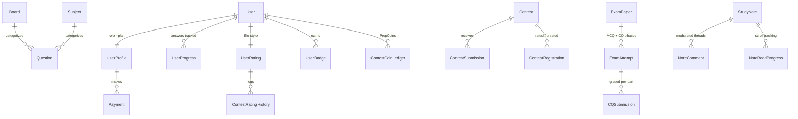

### Design diagrams

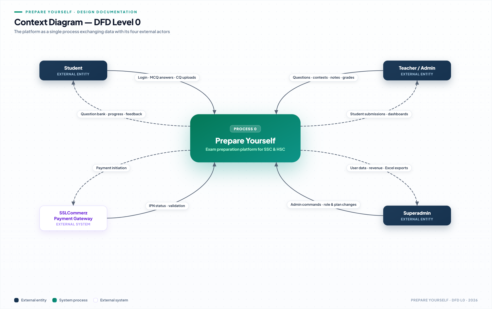

Detailed design documentation lives in [`diagrams/`](diagrams/) — all rendered
from hand-crafted HTML/SVG sources in [`diagrams/src/`](diagrams/src/):

| Diagram | File |
|---------|------|
| Context DFD (Level 0) | [`dfd_level0.png`](diagrams/dfd_level0.png) |
| System DFD (Level 1) | [`dfd_level1.png`](diagrams/dfd_level1.png) |
| DFD Level 2 — Question Bank / Contest / Payment | [`dfd_level2_question.png`](diagrams/dfd_level2_question.png) · [`dfd_level2_contest.png`](diagrams/dfd_level2_contest.png) · [`dfd_level2_payment.png`](diagrams/dfd_level2_payment.png) |
| Sequence — Login / MCQ / CQ Grading / Contest / Subscription | [`seq_login.png`](diagrams/seq_login.png) · [`seq_mcq.png`](diagrams/seq_mcq.png) · [`seq_cq_grade.png`](diagrams/seq_cq_grade.png) · [`seq_contest.png`](diagrams/seq_contest.png) · [`seq_subscription.png`](diagrams/seq_subscription.png) |
| Exam activity flow | [`activity_exam.png`](diagrams/activity_exam.png) |
| Tech stack overview | [`tech_stack.png`](diagrams/tech_stack.png) |
| Project Gantt chart | [`gantt_chart.png`](diagrams/gantt_chart.png) |

---

## 🛠 Tech Stack

| Layer | Technology |
|-------|-----------|
| **Backend** | Django 6.0.5, Python 3.12 |
| **Database** | SQLite (dev) — PostgreSQL via `DATABASE_URL` (dj-database-url) |
| **Frontend** | Tailwind CSS, GSAP + Lenis animations, Three.js hero, Chart.js, KaTeX math rendering |
| **Config** | python-dotenv (`.env` secrets), env-driven hosts/email/DB |
| **Deployment** | Gunicorn + WhiteNoise with manifest static files (Procfile included) |
| **AI** | Anthropic API (note generation, MCQ, summaries), Gemini (OCR) |
| **Admin** | Django Jazzmin 3.0.4 |
| **File Processing** | Pillow, python-docx, python-pptx, openpyxl, xlsxwriter |
| **Data / Charts** | Matplotlib, NumPy |
| **Testing** | Django TestCase, Selenium WebDriver, ruff (CI lint) |

---

## 🚀 Getting Started

### Prerequisites

- Python 3.11 or higher — [download](https://www.python.org/downloads/) (check **"Add Python to PATH"** during install)
- Git

### Installation (Windows — one click)

```bat
# 1. Clone the repo
git clone https://github.com/turtle-xo7/PrepareYourself.git
cd PrepareYourself

# 2. Run the one-time setup
#    (creates .venv, installs packages, generates .env with a fresh SECRET_KEY, runs migrations)
setup.bat
```

> Optional: open `.env` afterwards to add your own `GEMINI_API_KEY`, `ANTHROPIC_API_KEY`,
> and Gmail credentials — AI features and password-reset emails need them.

### Running the Server

```bat
run.bat
```

Then open **http://127.0.0.1:8000/** in your browser.

### Manual Setup (Linux / macOS)

```bash
git clone https://github.com/turtle-xo7/PrepareYourself.git
cd PrepareYourself

python3 -m venv .venv
source .venv/bin/activate

pip install -r requirements.txt

# Create your environment file and set SECRET_KEY (any long random string)
cp .env.example .env

python manage.py migrate
python manage.py runserver
```

### Create a Superuser (Admin Access)

```bash
# Windows
.venv\Scripts\python.exe manage.py createsuperuser

# Linux / macOS
.venv/bin/python manage.py createsuperuser
```

---

## 🧪 Running Tests

### Unit Tests

```bash
# Windows
.venv\Scripts\python.exe manage.py test core

# Linux / macOS
python manage.py test core
```

### Selenium End-to-End Tests

> Requires Chrome. Install the test dependencies first — the driver is downloaded automatically:
> `pip install -r requirements-dev.txt`

```bash
# Run the full Selenium suite (190+ tests)
python manage.py test core.test_selenium

# Run a specific module
python manage.py test core.test_selenium.test_auth
python manage.py test core.test_selenium.test_exam_papers
python manage.py test core.test_selenium.test_contests
```

Available Selenium test modules:

| Module | Coverage |
|--------|---------|
| `test_auth` | Registration, login, logout |
| `test_dashboard` | Student dashboard |
| `test_exam_papers` | MCQ + CQ exam flow |
| `test_contests` | Contest creation, participation, leaderboard |
| `test_study_notes` | Note creation, bookmarks, read progress |
| `test_notifications` | Notification delivery and read state |
| `test_practical` | Practical lab videos |
| `test_syllabus` | Syllabus viewer |
| `test_teacher` | Teacher verification, claim queue, grading |
| `test_pricing` | Subscription and payment flow |
| `test_superadmin` | Superadmin management actions |
| `test_profile` | Profile picture and settings |
| `test_question_bank` | Question bank CRUD and bulk MCQ |
| `test_home` | Home page and public views |
| `test_e2e` | Full end-to-end student journey |

---

## 📁 Project Structure

```
PrepareYourself/
├── core/                    # Main application
│   ├── models.py            # All data models (33 models)
│   ├── views/               # Request handlers, split by domain
│   │   ├── base.py          #   shared helpers, decorators, upload validation
│   │   ├── auth.py          #   login / signup / onboarding
│   │   ├── exams.py         #   exam papers, MCQ/CQ phases, grading
│   │   ├── contests.py      #   contests, submissions, leaderboards
│   │   └── ...              #   payments, notes, dashboard, manage, etc.
│   ├── services/            # Business logic (ratings, coins, badges, AI gateway)
│   ├── urls.py              # URL routing
│   ├── admin.py             # Admin configuration
│   ├── middleware.py        # Custom middleware
│   ├── context_processors.py
│   ├── templatetags/        # Custom template filters (Bangla support)
│   ├── migrations/          # Database schema history
│   ├── management/commands/ # Management commands (e.g. send_grading_reminders)
│   ├── test.py              # Unit test suite
│   └── test_selenium/       # Selenium E2E test suite (190+ tests)
├── prepare_yourself/        # Django project config
│   └── settings.py          # Reads secrets from .env
├── templates/               # HTML templates
│   ├── base.html            # Layout + toasts, global search, theme system
│   ├── core/
│   ├── manage/
│   └── teacher/
├── static/                  # CSS, JS, images
├── media/                   # User-uploaded files (gitignored)
├── docs/
│   └── screenshots/         # README screenshots (light + dark captures)
├── diagrams/                # Design documentation (2x PNG renders)
│   ├── dfd_*.png            #   context, system & level-2 data-flow diagrams
│   ├── seq_*.png            #   sequence diagrams (login, MCQ, grading, …)
│   ├── activity_exam.png    #   exam attempt activity flow
│   ├── tech_stack.png       #   layered tech stack
│   ├── gantt_chart.png      #   sprint timeline
│   └── src/                 #   HTML/SVG diagram sources + render guide
├── .github/workflows/ci.yml # CI: lint + checks + unit tests on every push/PR
├── .env.example             # Environment template (copy to .env)
├── Procfile                 # Production entrypoint (gunicorn)
├── requirements.txt         # Runtime dependencies
├── requirements-dev.txt     # + selenium, webdriver-manager, ruff
├── manage.py
├── setup.bat                # One-click Windows setup
└── run.bat                  # One-click dev server launcher
```

---

## 👥 Team

Built by a 4-person Scrum team:

| Name | Role | GitHub |
|------|------|--------|
| **Shad Bin Moshiur** | Project Manager & Lead Developer | [@Moshiur1143](https://github.com/Moshiur1143) |
| **Rajesh Majumder** | System Analyst & Developer | [@Rajash144](https://github.com/Rajash144) |
| **Fardin Rohit** | System Designer & Frontend Developer | [@23101149-cmyk](https://github.com/23101149-cmyk) |
| **Mohammad Shahariar** | Tester & QA Engineer | [@turtle-xo7](https://github.com/turtle-xo7) |

---

## 🤝 Contributing

We welcome contributions! Please read [CONTRIBUTING.md](CONTRIBUTING.md) before opening a pull request.

Quick summary:
1. Fork the repo and create a feature branch (`git checkout -b feat/your-feature`)
2. Write tests for your changes
3. Ensure the test suite passes
4. Open a pull request using our [PR template](.github/pull_request_template.md)

---

## 📄 License

This project is licensed under the **MIT License** — see [LICENSE](LICENSE) for details.

---

<div align="center">

Made with care for Bangladeshi students | Built with Django

</div>
